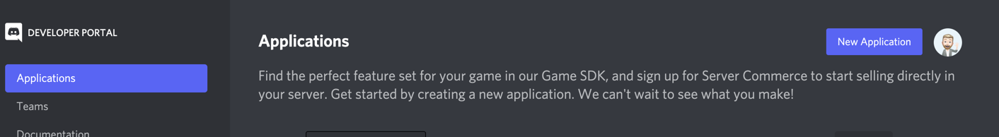
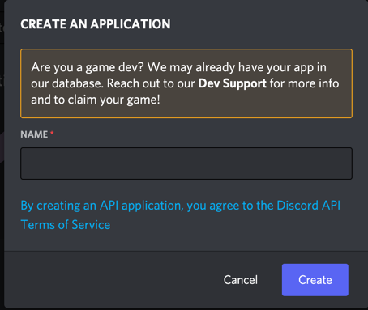
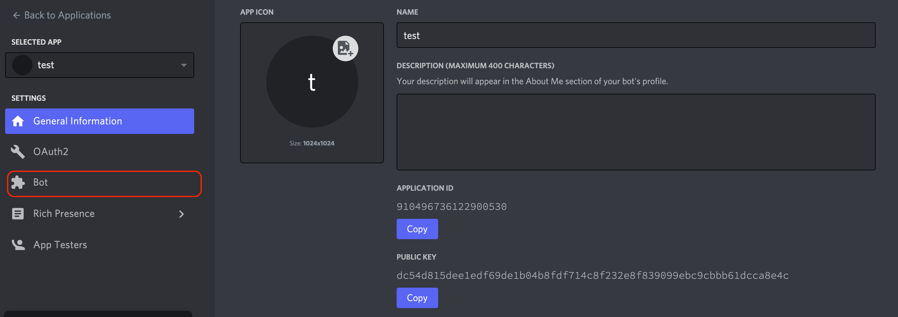
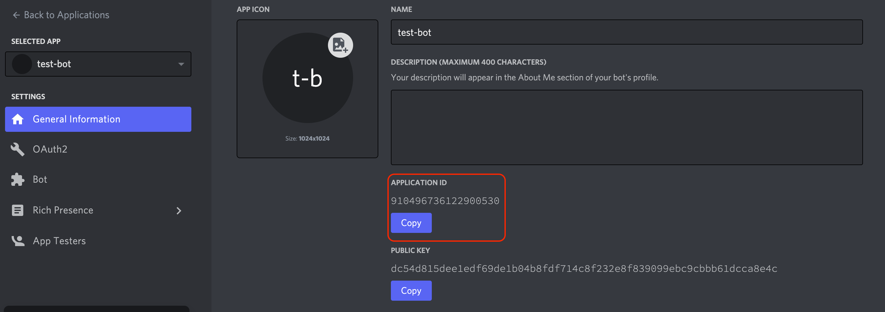
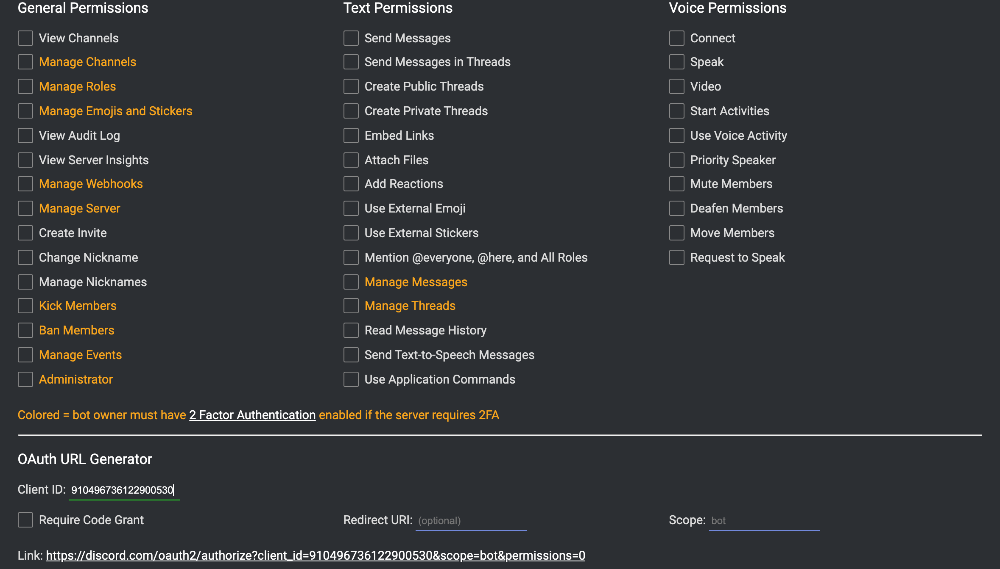
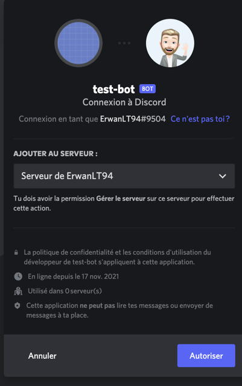
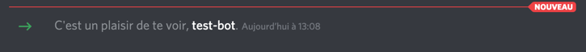

# Discord-bot
## create the bot
Go to following url
- [discord developers portal](https://discord.com/developers/applications)

and the click on the button **new application**

and choose a name for your bot

and click on **Create**

Normally you should see the application settings page, click on Bot

and then **Add bot** -> **Yes, do it!**

Now that your bot is created, you can find the bot token, copy it to the class BotConstant.

We will use this token to connect our bot to discord.

## Invite the bot to a channel
Return to the app settings and copy the application ID

go [here](https://discordapi.com/permissions.html) to add permission to your bot.

- Paste your application ID in the Client ID input.
- Click on the Administrator check box to activate it
- Click on the link in the bottom of the page

Now all you have to do, is to choose a server to invite the bot

Do the captcha and at the end in your server you should have a notification that the bot joined

